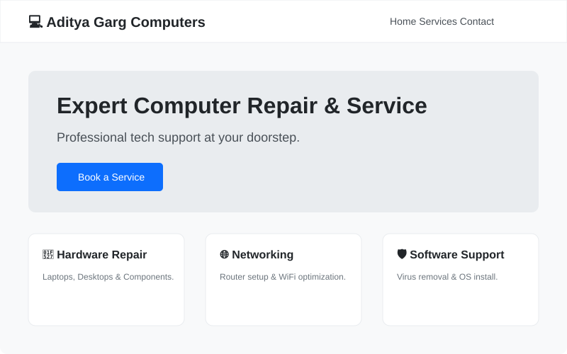
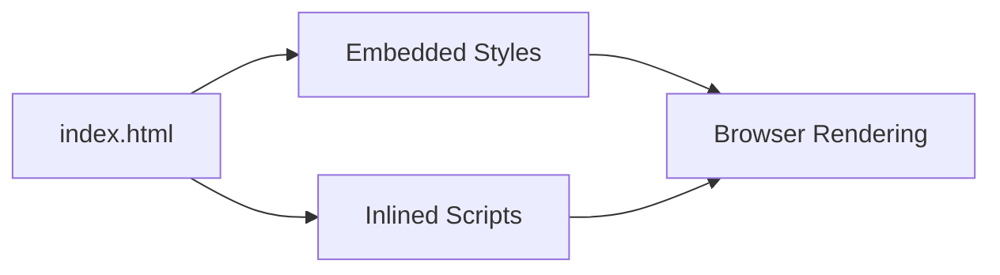

# 💻 Aditya Garg Computers Online
**A Modern Revival of a Local Tech Business Hub**

**Aditya Garg Computers Online** is a responsive business landing page revived for modern web standards. It focuses on clean typography, accessibility, and high performance for local tech service discovery.

`✅ Business Hub Revival | ✅ Responsive Design | ✅ MIT Licensed | ✅ SEO Optimized`

## 🎬 UI Preview

## 🏗 Architecture
The project follows a simple, monolithic static architecture for maximum speed and SEO efficiency.

### Core Components
- **Main View (`index.html`)**: Single-entry point containing the entire structural markup and semantic content.
- **Styling Layer**: Responsive CSS rules embedded directly to minimize HTTP requests.
- **Service Hub**: Categorized blocks for Hardware, Networking, and Software support.

## 🚀 Getting Started
Just open `index.html` in any modern web browser.

## 📜 License
This project is licensed under the **MIT License** - see the [LICENSE](LICENSE) file for details.

---
*Built with ❤️ for Local Business Revival.*
